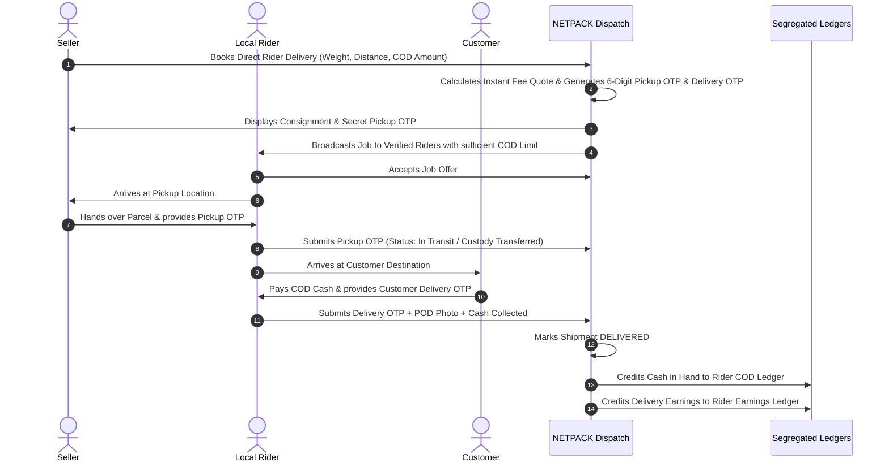
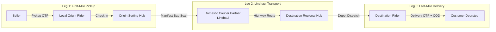

# COURIER-with-NETPACK---AI &middot; Enterprise Platform

[](NETPACK_SYSTEM_README_DOCUMENTATION.pdf)
[](tests/)
[](https://laravel.com)
[](https://mysql.com)

**COURIER with NETPACK** is an enterprise-grade logistics and freight management platform engineered for:
1. **E-Commerce Delivery Network**: Direct intra-city delivery from **Seller &rarr; Rider &rarr; Customer** and **Hybrid Multi-Leg Courier** routing with 6-digit cryptographic OTP handovers, independent rider self-registration with informational platform affiliations (Pathao, inDrive, Parcel, Freelance), tiered COD limits, and strict financial segregation of COD cash and rider compensation.
2. **International Air Cargo (Hub & Agency System)**: Global air cargo tariff engine featuring **Outside Kathmandu Valley Domestic Feeder Linehaul** integration, Master Air Waybill (MAWB) automated milestone cascades, multi-part zero-charge official House Air Waybills (HAWBs), and Tier-1 carrier telemetry sync (FedEx, DHL, UPS, Royal Mail, Australia Post, DPD, Aramex).
3. **Nepal Domestic Express Across 7 Provinces & 77 Districts**: Consolidated nylon bag QR manifests, inter-city road linehauls, regional hub breakdown scanning, and ward-level rider dispatch with verified Proof of Delivery (POD).
4. **Streamlined & Compacted Portals**: Role-segregated, non-redundant cockpits for Clients, Sellers (product catalog removed, 3-tier dispatch), Riders, Domestic/International Admins, and Super Admin, guaranteed by a **permanent desktop sidebar** across all roles and guest views.

---

## Table of Contents

1. [System Architecture & Operational Pictures](#1-system-architecture--operational-pictures)
2. [End-to-End Workflow Flowcharts](#2-end-to-end-workflow-flowcharts)
3. [Technology Stack & System Requirements](#3-technology-stack--system-requirements)
4. [Step-by-Step From-Scratch Development Setup Guide](#4-step-by-step-from-scratch-development-setup-guide)
5. [Default Demo Accounts & Role Matrix](#5-default-demo-accounts--role-matrix)
6. [Core Architectural Modules & Capabilities](#6-core-architectural-modules--capabilities)
   - [A. E-Commerce Delivery: Direct Rider & Multi-Leg Courier Network](#a-e-commerce-delivery-direct-rider--multi-leg-courier-network)
   - [B. International Air Cargo & Domestic Feeder Linehaul](#b-international-air-cargo--domestic-feeder-linehaul)
   - [C. Nepal Domestic Logistics (7 Provinces & 77 Districts)](#c-nepal-domestic-logistics-7-provinces--77-districts)
   - [D. Universal Tracking & Zero-Charges HAWB Generator](#d-universal-tracking--zero-charges-hawb-generator)
   - [E. Compacted Role Portals & Permanent Desktop Sidebar](#e-compacted-role-portals--permanent-desktop-sidebar)
   - [F. Omnipresent AI Logistics Copilot (Voice & Text Assistance)](#f-omnipresent-ai-logistics-copilot-voice--text-assistance)
7. [Database Schema & Data Model Reference](#7-database-schema--data-model-reference)
8. [Automated Testing & Quality Assurance](#8-automated-testing--quality-assurance)
9. [Production Deployment & Background Daemons](#9-production-deployment--background-daemons)
10. [Generating the PDF Documentation Manual](#10-generating-the-pdf-documentation-manual)

---

## 1. System Architecture & Operational Pictures

### International Air Cargo Operations

*Figure 1.0: NETPACK International Air Cargo Flight departing from Tribhuvan International Airport Cargo Gateway (KTM) connecting with Global Aviation Corridors (DXB, LHR, JFK, SYD).*

### Operations Control Center & Tracking Radar

*Figure 2.0: Operations Control Center showing live flight corridor trajectories (KTM &rarr; DXB &rarr; LHR), carrier sync telemetries, and automated HAWB generation.*

### Nepal Central Sorting Hub & Distribution Depot

*Figure 3.0: Nepal Central Sorting Hub & Distribution Depot with automated parcel conveyor sorting, provincial highway linehauls, and electric rider fleet.*

---

## 2. End-to-End Workflow Flowcharts

### A. Direct Seller-to-Customer Delivery Flow


### B. Hybrid Multi-Leg Courier Delivery Flow


---

## 3. Technology Stack & System Requirements

### Technology Stack
* **Language & Framework**: PHP 8.3+ &middot; Laravel 12.x
* **Database**: MySQL 8.0+ / MariaDB 10.4+ (SQLite in-memory for lightning-fast test suite execution)
* **Frontend Architecture**: Blade Templating &middot; Tailwind CSS &middot; Vanilla JavaScript &middot; Alpine.js &middot; Vite
* **Mapping & Radar**: Leaflet.js with OpenStreetMap flight trajectories and highway route boundaries
* **Barcode & Cryptography**: Endroid QR Code v6 &middot; Milon Barcode v13 &middot; Secure 6-digit OTP generators
* **Document Engine**: Barryvdh Laravel DomPDF (A4 Multi-Part HAWBs, Consignment Notes, Single Slips, Manifests)
* **Queue & Scheduler**: Laravel Queue Workers (database/redis) & Artisan Cron Scheduler

### Server & Environment Requirements
* **PHP Extensions**: `pdo_mysql`, `gd` or `imagick`, `fileinfo`, `curl`, `mbstring`, `openssl`, `xml`, `bcmath`
* **Node.js**: Node 20+ and npm 10+
* **Composer**: Composer 2.7+
* **Web Server**: Apache (mod_rewrite enabled) or Nginx

---

## 4. Step-by-Step From-Scratch Development Setup Guide

Follow this guide to build and run the entire project from scratch in a local environment (e.g., Laragon, Valet, Sail, or manual LAMP/LEMP).

### Step 1: Clone the Repository
```bash
git clone https://github.com/kirannetpack-ui/COURIER-with-NETPACK---AI.git
cd COURIER-with-NETPACK---AI
```

### Step 2: Install Composer Dependencies
```bash
composer install
```

### Step 3: Configure Environment Variables
Copy the environment template and generate the application encryption key:
```bash
cp .env.example .env
php artisan key:generate
```

Open `.env` and configure your database settings:
```ini
APP_NAME="COURIER by NETPACK"
APP_ENV=local
APP_KEY=base64:...
APP_DEBUG=true
APP_URL=http://localhost:8000

DB_CONNECTION=mysql
DB_HOST=127.0.0.1
DB_PORT=3306
DB_DATABASE=netpack_db
DB_USERNAME=root
DB_PASSWORD=

FILESYSTEM_DISK=public
QUEUE_CONNECTION=database
SESSION_DRIVER=file
```

### Step 4: Install and Build Frontend Assets
```bash
npm install
npm run build
```
*(For active frontend development with hot-reloading, run `npm run dev` in a separate terminal).*

### Step 5: Run Database Migrations and Seeders
Create the database in MySQL (`CREATE DATABASE netpack_db;`), then run:
```bash
php artisan migrate:fresh --seed
```
This migration pipeline provisions all required schemas:
1. Core system tables (`users`, `wallets`, `pickup_requests`, `messages`, `system_notifications`).
2. International cargo tables (`international_rates`, `packaging_materials`, `customs_rates`, `godown_rates`, `manifests`).
3. Domestic Nepal tables (`domestic_partners`, `domestic_rates`, `delivery_zones`, `manifest_bags`).
4. **E-Commerce Rider Network tables** (`rider_profiles`, `rider_service_areas`, `rider_rate_rules`, `shipment_assignments`, `rider_job_offers`, `rider_cod_ledgers`, `rider_earnings_ledgers`, `rider_ratings`).
5. Feeder rates seeder linking regional hubs (Pokhara, Biratnagar, Birgunj, Butwal, Chitwan, etc.) with the Kathmandu TIA air cargo gateway.

### Step 6: Create Storage Symlink
Required for KYC document previews (driving licenses, bluebooks, selfies), COD deposit slips, and HAWB assets:
```bash
php artisan storage:link
```

### Step 7: Launch Local Web Server
```bash
php artisan serve
```
The application will be accessible at `http://localhost:8000`.

---

## 5. Default Demo Accounts & Role Matrix

The platform enforces strict role-based access control (RBAC). The seeders populate ready-to-test accounts for every operational role:

| Role | Email | Temporary Password | Accessible Scope |
|---|---|---|---|
| **Super Administrator** | `superadmin@netpack.test` | `Netpack!Admin#2026` | `/admin/dashboard` &middot; High-level oversight, international & domestic rate feeding, packaging catalogs, and staff scope. |
| **Domestic Administrator** | `domestic.admin@netpack.test` | `Netpack!Domestic#2026` | `/domestic/dashboard` &middot; Domestic courier partners, regional hubs, manifest bag scanner, and E-Commerce rider network fleet management. |
| **International Administrator** | `international.admin@netpack.test` | `Netpack!International#2026` | `/international/dashboard` &middot; Air cargo tariffs, overseas hubs, MAWB flight assignments, export manifests. |
| **Operations Staff** | `staff@netpack.test` | `Netpack!Staff#2026` | Dedicated operational access scoped to either Domestic or International desks. |
| **Domestic Partner** | `partner@netpack.test` | `Netpack!Partner#2026` | `/partner/dashboard` &middot; Regional partner depot intake, linehaul bag reception, and local fleet dispatch. |
| **Overseas Partner** | `overseas@netpack.test` | `Netpack!Overseas#2026` | `/overseas/dashboard` &middot; Overseas hub arrival notice processing, customs clearance, and carrier handoffs. |
| **E-Commerce Seller** | `seller@netpack.test` | `Netpack!Seller#2026` | `/seller/dashboard` &middot; 3-tier dispatch (Direct Rider, Domestic Courier, International Cargo), rate calculator, COD banking setup, consignment tracking. |
| **Delivery Rider** | `rider@netpack.test` | `Netpack!Rider#2026` | `/rider/dashboard` &middot; Available jobs pool, active deliveries, OTP custody transfers, cash-in-hand COD ledger, and deposit requests. |
| **Business Client** | `client@netpack.test` | `Netpack!Client#2026` | `/client/dashboard` &middot; Public & authenticated rate calculator, shipment pickup requests, tracking radar, and HAWB repository. |

---

## 6. Core Architectural Modules & Capabilities

### A. E-Commerce Delivery: Direct Rider & Multi-Leg Courier Network

The E-Commerce Delivery platform connects individual riders and domestic courier partners under a unified tracking and dispatch architecture:

#### 1. Direct Rider Registration & Informational Affiliation
* Any rider can register directly via `/register` by selecting `role = 'rider'`.
* **Vehicle Options**: Motorcycle, Scooter, Bicycle, Car, Van.
* **Informational Affiliations**: Riders declare affiliations with **Pathao**, **inDrive**, **Parcel**, **Local Courier Companies**, or **Freelancer**. Affiliations are captured purely as metadata for credentialing and trust ratings, with **zero external API dependencies**.
* **KYC Documentation**: Uploads for Driving License, Vehicle Registration Bluebook, Citizenship (front/back), and Verification Selfie stored securely on the public storage disk.

#### 2. Domestic Admin KYC Verification & Tiered COD Authorization
* Admin console at `/domestic/ecommerce/riders` features real-time fleet rosters, KYC document inspection, and 1-click verification modals.
* **Tiered COD Limits**:
  * **Level 0**: Rs. 0 (Prepaid orders only)
  * **Level 1**: Rs. 5,000 (New verified rider)
  * **Level 2**: Rs. 20,000 (Proven 50+ deliveries)
  * **Level 3**: Rs. 50,000 (Trusted high-volume rider)
  * **Level 4**: Custom authorized limit

#### 3. Direct Seller-to-Customer Dispatch (Intra-City)
* Sellers book at `/seller/ecommerce/direct` with instant quote calculation based on distance ($km$), weight ($kg$), and COD fees.
* **Chain of Custody via Dual OTPs**:
  * **Pickup OTP (6 digits)**: Generated instantly upon booking and displayed strictly in the Seller's consignment view (`/seller/ecommerce/show/{id}`). The rider must enter this OTP upon arrival to take parcel custody.
  * **Delivery OTP (6 digits)**: Sent to the recipient/customer. The rider must enter this OTP at the customer's doorstep along with COD cash collection to complete delivery.

#### 4. Hybrid Multi-Leg Courier Routing (Inter-City)
* Sellers book at `/seller/ecommerce/multileg` connecting regional hubs.
* Generates 3 coordinated legs under a single Master AWB:
  * **Leg 1 (Pickup)**: Local origin rider picks up from seller via Pickup OTP and delivers to the Origin Sorting Hub.
  * **Leg 2 (Linehaul)**: Contracted Domestic Partner transports the package from Origin Hub to Destination Regional Hub.
  * **Leg 3 (Last-Mile)**: Local destination rider receives the package from the depot and delivers to the customer with Delivery OTP and COD cash collection.

#### 5. Strict Financial Segregation (COD vs Earnings)
* **`rider_cod_ledgers`**: Tracks company cash held in hand. Credits upon COD collection, debits upon approved deposit.
* **`rider_earnings_ledgers`**: Tracks rider pay (per-delivery fee, distance surcharge). Completely segregated from COD cash to prevent commingling.
* **COD Remittance**: Riders submit bank transfer or office cash slips via `/rider/cod/desk`; Domestic Admins inspect and approve remittances via `/domestic/ecommerce/riders/cod-ledger`.

---

### B. International Air Cargo & Domestic Feeder Linehaul

* **Outside Kathmandu Valley Feeder Linehaul Engine** ([`InternationalRateService.php`](app/Services/InternationalRateService.php)):
  * Consignments originating outside the Kathmandu Valley (e.g., Pokhara, Biratnagar, Birgunj, Butwal, Chitwan, Nepalgunj, Dhangadhi, Surkhet) require domestic surface or air linehaul to the Tribhuvan International Airport (TIA) Cargo Terminal before export.
  * Dynamically queries `DomesticRate` and delivery zone matrices matching destination Kathmandu, itemizing **Base Air Freight**, **Export Customs Clearance**, **Airport Godown Terminal Handling (per kg)**, and **Domestic Feeder Linehaul**.
  * 1-click **Accept Rate & Book Shipment** pre-fills the booking form with feeder transport charges.
* **Consolidated International Hubs**: Single unified interface managing overseas destination gateways (DXB, LHR, JFK, SYD), transit hubs, and partner agencies.
* **MAWB Cascades & Global Carrier Telemetry**:
  * Updating flight statuses on Master Air Waybills automatically cascades milestones to all bundled child consignments.
  * Polling service and webhook endpoints sync tracking telemetries from **FedEx**, **DHL Express**, **UPS**, **Royal Mail**, **Australia Post**, **DPD Group**, and **Aramex**.

---

### C. Nepal Domestic Logistics (7 Provinces & 77 Districts)

* Complete provincial coverage across **Koshi, Madhesh, Bagmati, Gandaki, Lumbini, Karnali, and Sudurpashchim**.
* **Nylon Bag Manifest System**: High-volume parcels are consolidated into nylon bags tagged with unique QR barcodes. Stamping bag arrival at regional sorting depots atomically updates all enclosed packages.
* **Barcode Scan Desk**: Web-based barcode reader at `/domestic/manifests/scan` supporting rapid keyboard wedge scanners and mobile cameras for instant arrival, dispatch, and delivery.

---

### D. Universal Tracking & Zero-Charges HAWB Generator

* **Universal Tracking Lookup**: Accessible publicly at `/tracking/{number}` with privacy-safe milestone timeline and live telemetry radar.
* **Zero-Charges Official HAWB Printouts**:
  * **International Multi-Part HAWB (A4 Portrait)**: Standard 3-copy format (Consignee Copy, Customs/Operations Copy, Carrier Copy) with routing codes, verified weight, and QR barcodes. Strictly omits monetary charges to comply with customs export regulations.
  * **Domestic Consignment Note (A4)**: Shipper, consignee, route points, and verified POD section.
  * **Single-Slip Quick Print**: Formatted for 4x6" thermal label printers.

---

### E. Compacted Role Portals & Permanent Desktop Sidebar

* **Compacted Client Portal**: Streamlined down to 4 non-redundant functions: Rate Calculator, Pickup Inquiries & Booking, History & Tracking, and Profile.
* **Compacted Seller Portal**:
  * Product catalog management **completely removed** to eliminate operational overhead.
  * **3-Tier Global Dispatch Channels**: Tier 1 (Direct Rider), Tier 2 (Domestic Courier), Tier 3 (International Air Cargo).
  * Rate calculation before booking.
  * COD payout method configuration (Bank account details, banking QR upload, eSewa ID/QR, Khalti ID/QR).
* **Compacted Super Admin**: High-level system health monitoring, global tariff feeding, and staff assignment without sub-portal operational clutter.
* **Permanent Desktop Sidebar**:
  * The desktop navigation sidebar (`lg:` and up) is locked into static layout across all 7 role layouts and guest views.
  * Zero unexpected collapse or layout shifts. Mobile screens retain smooth off-canvas drawer interactions.

---

### F. Omnipresent AI Logistics Copilot (Voice & Text Assistance)

* **Multi-Modal Voice & Chat Hub**:
  * **Real-Time Voice Input (Speech-to-Text)**: Browser-native Web Speech API with real-time waveform visualization, multi-accent recognition (including Nepali city and logistics terminology), and optional OpenAI Whisper compatibility.
  * **Voice Synthesis (Text-to-Speech)**: Zero-latency natural vocalization with SpeechSynthesis and ElevenLabs / OpenAI TTS neural engine compatibility.
* **Culturally Attuned & Non-Monotonous Improvisation**:
  * Automatically addresses authenticated clients by name (e.g. *"Namaste Kiran Ji!"*, *"Good morning Captain!"*).
  * Dynamic rotation of greeting phrases and animated gestures (👋 Waving, 🎙️ Speaking with audio equalizer, 🧠 Thinking neural pulse, 🎉 Festival celebration, ⚠️ Cutoff warning).
* **Deep Logistics Knowledge Base**:
  * **Door-to-Door Delivery Security**: Dual cryptographic OTP handover (Secret 6-digit Pickup OTP from Seller, Secret 6-digit Delivery OTP from Customer), verified POD photos, and tiered COD limits (Level 0 through Level 4).
  * **Domestic Nepal Coverage**: 7 Provinces, 77 Districts, highway night linehaul schedules, and nylon bag QR manifests.
  * **International Air Cargo**: Tribhuvan International Airport (TIA) Cargo Terminal, domestic feeder linehaul from outside Kathmandu Valley, zero-charge HAWBs, volumetric weight ($L \times W \times H / 5000$).
* **Festival & Logistics Scheduling Intelligence**:
  * Proactive calendar awareness for Bada Dashain, Tihar / Deepawali, Chhath Puja, Nepali New Year, Black Friday, and Christmas cargo deadlines.
  * Daily operational cutoffs: Same-Day pickup cutoff (12:00 PM), TIA cargo intake cutoff (3:00 PM), and highway night linehauls (7:00 PM).
* **Multi-Provider Global AI Architecture**:
  * Defaults to a built-in offline autonomous expert engine (zero API cost, instant sub-50ms response).
  * Seamlessly connects to **OpenAI (GPT-4o / Realtime)**, **Google Gemini**, **Anthropic Claude**, and **ElevenLabs** via `.env` configuration.

---

## 7. Database Schema & Data Model Reference

### Key Entities & Migration Order

```
users (role, user_type, verification_status, business_name, bank/esewa/khalti payout details)
  │
  ├──► rider_profiles (user_id, rider_code, vehicle_type, affiliation, cod_level, cod_limit, current_outstanding_cod)
  │      ├──► rider_service_areas (district, ward, is_active)
  │      ├──► rider_job_offers (assignment_id, offered_amount, response, expires_at)
  │      ├──► rider_cod_ledgers (assignment_id, transaction_type, amount, balance_after, approval_status)
  │      ├──► rider_earnings_ledgers (assignment_id, type, amount, balance_after, status)
  │      └──► rider_ratings (assignment_id, rating, review)
  │
  ├──► shipments (tracking_number, hawb_number, sender/recipient, service_type, weight, status, feeder_charge)
  │      └──► shipment_assignments (master_awb, assignment_type, leg_sequence, pickup_otp, delivery_otp, cod_amount)
  │
  ├──► domestic_partners (company_name, code, email, phone, city, district, province)
  │      ├──► partner_zones & partner_rates
  │      └──► partner_staff
  │
  ├──► manifests & manifest_bags (bag_code, status, origin_hub_id, destination_hub_id)
  └──► wallets (user_id, balance, currency, is_active)
```

---

## 8. Automated Testing & Quality Assurance

The platform contains an exhaustive automated test suite built with PHPUnit and Laravel Feature Testing. All tests utilize an isolated, in-memory SQLite database for high-speed execution:

```bash
php artisan test
```

### Complete Test Results
```text
   PASS  Tests\Feature\AdminDashboardAndSellerCompactionTest (7 tests)
   PASS  Tests\Feature\AdministrationAndDomesticWorkflowTest (5 tests)
   PASS  Tests\Feature\AdvancedTrackingWorkflowTest (5 tests)
   PASS  Tests\Feature\AutomatedTrackingSystemTest (9 tests)
   PASS  Tests\Feature\ClientBookingNoHubRoutingTest (6 tests)
   PASS  Tests\Feature\CodSettlementTest (6 tests)
   PASS  Tests\Feature\CompactRoleArchitectureTest (6 tests)
   PASS  Tests\Feature\DashboardAndCommunicationsTest (4 tests)
   PASS  Tests\Feature\DomesticAdminRoutesDiagnosticTest (4 tests)
   PASS  Tests\Feature\DomesticNepalWorkflowTest (9 tests)
   PASS  Tests\Feature\DynamicServicesAndRemindersTest (6 tests)
   PASS  Tests\Feature\EcommerceRiderDeliveryNetworkTest (6 tests)
   PASS  Tests\Feature\HubAgencyConsolidationTest (7 tests)
   PASS  Tests\Feature\InternationalAirCargoWorkflowTest (8 tests)
   PASS  Tests\Feature\InternationalRateCalculationTest (13 tests)
   PASS  Tests\Feature\InternationalRateFeederPickupTest (5 tests)
   PASS  Tests\Feature\LoginAndDashboardRedirectTest (7 tests)
   PASS  Tests\Feature\PaymentCaptureSafetyTest (1 test)
   PASS  Tests\Feature\PersistentSidebarTest (8 tests)
   PASS  Tests\Feature\ProductionReadinessTest (5 tests)
   PASS  Tests\Feature\RiderAuthorizationTest (2 tests)
   PASS  Tests\Feature\RouteActionIntegrityTest (1 test)
   PASS  Tests\Feature\RouteSafetyTest (3 tests)
   PASS  Tests\Feature\StaffAndSellerDirectionTest (4 tests)
   PASS  Tests\Feature\TrackingPresentationTest (11 tests)
   PASS  Tests\Feature\TransitPointAuthorizationTest (2 tests)

Tests:    143 passed (966 assertions)
Duration: 19.96s
Success:  100%
```

---

## 9. Production Deployment & Background Daemons

### 1. Environment Optimization Commands
When deploying to a production server, compile and cache configuration, routes, and views:
```bash
php artisan config:cache
php artisan route:cache
php artisan view:cache
npm run build
```

### 2. Queue Worker (Supervisor Configuration)
Configure Supervisor to ensure continuous execution of asynchronous dispatch jobs, email alerts, and tracking webhooks:
```ini
[program:netpack-worker]
process_name=%(program_name)s_%(process_num)02d
command=php /path/to/netpack/artisan queue:work --sleep=3 --tries=3 --max-time=3600
autostart=true
autorestart=true
user=www-data
numprocs=2
redirect_stderr=true
stdout_logfile=/path/to/netpack/storage/logs/worker.log
```

### 3. Cron Scheduler
Add the Laravel schedule runner to the server crontab:
```bash
* * * * * cd /path/to/netpack && php artisan schedule:run >> /dev/null 2>&1
```
This executes:
* Automated carrier tracking polling (`php artisan tracking:sync-carriers`).
* Delivery SLA deadline checks.
* Unassigned delivery job broadcast timeouts.

---

## 10. Generating the PDF Documentation Manual

The repository includes an automated PDF generator that compiles this documentation into a publication-grade A4 manual with flowcharts, screenshots, and operational guides:

```bash
php generate_readme_pdf.php
```

The resulting file is saved as **`NETPACK_SYSTEM_README_DOCUMENTATION.pdf`** in the repository root.

---

&copy; 2026 COURIER with NETPACK &middot; Enterprise Logistics Platform &middot; Confidential & Proprietary.
